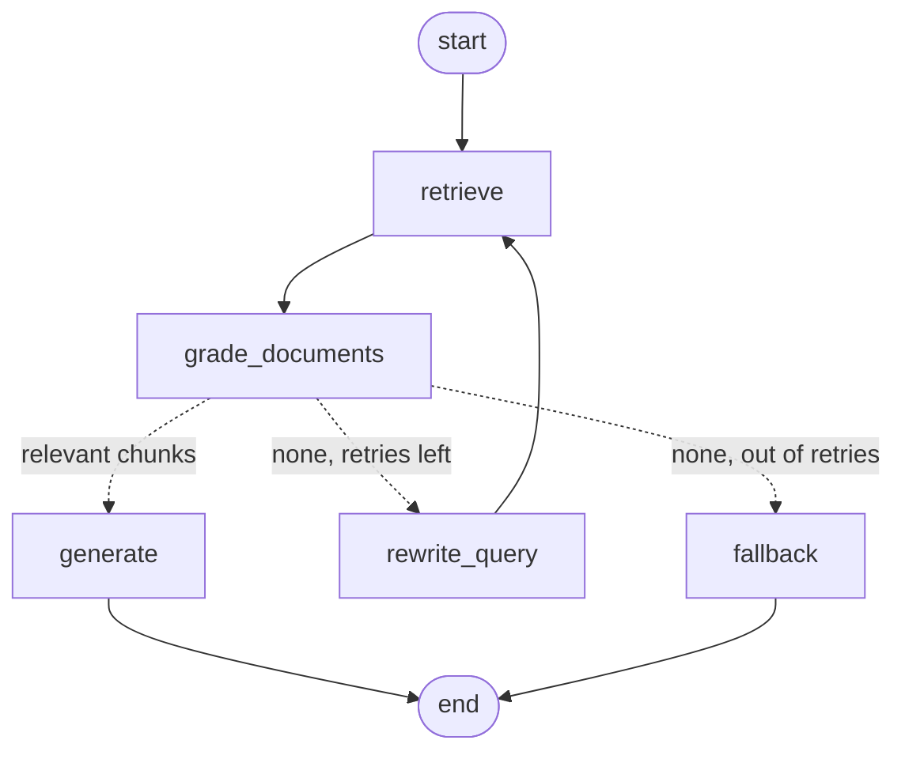

# Week 4 — Advanced AI Foundations: LangGraph & Agentic Workflow

Internship Phase 1 / Week 4 deliverable: the Week 3 RAG pipeline rebuilt as a **LangGraph** state machine. The graph retrieves chunks from **PostgreSQL + pgvector**, grades their relevance, rewrites the query and retries when nothing relevant comes back, and answers "I don't know" instead of hallucinating. A linear **LangChain (LCEL)** version of the same flow is included for comparison.

Hybrid search and reranking are intentionally **not** included (planned for Week 9).

## Stack

- Python 3.12, `langgraph` 1.2, `langchain-core` 1.6
- Chat: Qwen (VPS), Gemini (`gemini-3.5-flash-lite`), OpenAI `gpt-4o-mini`, or Ollama
- Embeddings: Ollama `nomic-embed-text`, or Gemini / OpenAI embeddings when that provider is selected
- PostgreSQL 16 + pgvector (HNSW cosine index) via Docker Compose
- Shared LLM keys/models can be edited in **internship-dashboard → Settings** (writes this folder’s `.env`)

## The graph



Regenerate it from code with `python src/main.py --graph`.

| Concept | Where |
|---|---|
| **State** — `RagState` TypedDict; `steps` uses an `operator.add` reducer to append a trace | `src/state.py` |
| **Nodes** — `retrieve`, `grade_documents`, `rewrite_query`, `generate`, `fallback` | `src/nodes.py` |
| **Edges** — normal edges, a conditional edge (`route_after_grading`), and a loop back to `retrieve` | `src/graph.py` |
| **LCEL baseline** — `{question, documents} \| assign(answer)` | `src/chain_baseline.py` |

`grade_documents` keeps chunks whose cosine distance is `<= MAX_DISTANCE` (default 0.5). With `nomic-embed-text` on the sample data, on-topic questions scored 0.21–0.49 and off-topic ones (weather, football, recipes) 0.55–0.63.

## Quick start

```bash
cd week4-langgraph-rag
docker compose up -d                 # pgvector on host port 5435
cp .env.example .env                 # set QWEN_API_KEY or OPENAI_API_KEY
python3.12 -m venv .venv && source .venv/bin/activate
pip install -r requirements.txt
ollama pull nomic-embed-text         # unless using OpenAI embeddings

python src/main.py                   # interactive; auto-ingests data/ on first run
python src/main.py -q "How is LangGraph different from LangChain?"
python src/main.py --mode chain -q "What is the weather in Hanoi?"
pytest -q                            # graph routing tests, no DB/LLM needed
```

Every `.txt` / `.md` file in `data/` is ingested.

### CLI commands

| Command | Action |
|---|---|
| (text) | Ask a question |
| `/mode graph\|chain` | Switch between LangGraph and the LCEL chain |
| `/trace on\|off` | Show node-by-node execution (graph mode) |
| `/graph` | Print the Mermaid diagram |
| `/ingest` / `/stats` | Re-ingest `data/` / show chunk count |
| `/quit` | Exit |

## Sample runs

Relevant question: one retrieval pass, then generate.

```text
· [retrieve] retrieve#1: 4 chunks for 'How is LangGraph different from traditional LangChain?'
· [grade_documents] grade: 3/4 chunks within distance <= 0.5
· [generate] generate: answered from context
```

Vague question (`MAX_DISTANCE=0.4`): rewrite, then a successful second pass.

```text
· [retrieve] retrieve#1: 4 chunks for 'lg vs lcel?'
· [grade_documents] grade: 0/4 chunks within distance <= 0.4
· [rewrite_query] rewrite: 'lg vs lcel: comparison of langgraph and langchain expression language'
· [retrieve] retrieve#2: 4 chunks for 'lg vs lcel: comparison of langgraph and langchain expression language'
· [grade_documents] grade: 3/4 chunks within distance <= 0.4
· [generate] generate: answered from context
```

Off-topic question: two passes, then fallback without calling the answer LLM (~3s). The LCEL chain always calls the LLM on whatever it retrieved (~25s on the Qwen VPS).

```text
· [grade_documents] grade: 0/4 chunks within distance <= 0.5
· [rewrite_query] rewrite: ...
· [grade_documents] grade: 0/4 chunks within distance <= 0.5
· [fallback] fallback: no relevant context
```

## LangGraph vs traditional LangChain

| | LangChain LCEL chain | LangGraph |
|---|---|---|
| Shape | Linear DAG (`a \| b \| c`) | Graph / state machine, cycles allowed |
| Control flow | Fixed order, runs once | Conditional edges, loops, retries |
| State | Implicit dict passed down the pipe | Explicit typed state with reducers |
| Off-topic question | Always calls the LLM on low-quality context | Grades, rewrites, then falls back |
| Observability | Final output | `stream(stream_mode="updates")` per node |
| Extras | — | Checkpointing, human-in-the-loop, persistence |
| Best for | Simple prompt → model → parser steps | Orchestrating multi-step / agentic flows |

They are complementary: LangGraph nodes can wrap LCEL runnables, models, and retrievers.

## Project structure

```text
week4-langgraph-rag/
  data/                 # knowledge base (.txt / .md)
  src/
    main.py             # CLI (REPL + one-shot)
    pipeline.py         # wires real clients into graph + chain; ingest
    state.py            # RagState
    nodes.py            # node functions, router, prompts
    graph.py            # StateGraph wiring
    chain_baseline.py   # LCEL comparison
    config.py  llm.py  embeddings.py  vector_store.py  chunking.py
  tests/test_graph.py   # routing tests with fake embed/search/LLM
```

## Phase 1 wrap-up (for the mentor review)

| Week | Deliverable | Folder |
|---|---|---|
| 1 | Express + TypeScript + Prisma user API, JWT/roles, Docker Compose | `week1-user-api/` |
| 2 | React + Tailwind + shadcn/ui app, protected routes, static chat UI | `week2-react-app/` |
| 3 | Python RAG script: chunk → embed → pgvector → answer | `week3-rag-demo/` |
| 4 | Same RAG on LangGraph with grading, query rewrite, fallback; LCEL comparison | `week4-langgraph-rag/` |

Known limitations and what comes next:

- Relevance grading is a distance threshold that has to be tuned per embedding model. An LLM grader or a reranker (Week 9) would be more robust.
- Character-based chunking can split sentences mid-way. Week 7 introduces a real ingestion pipeline.
- The graph runs as a CLI. Week 8 wraps it in a FastAPI service called by the Node backend and React chat UI.
- No hybrid (BM25) search yet (Week 9).

## Learning checklist (Week 4)

- [ ] Explain State, Node, Edge, conditional edge, and reducers in LangGraph
- [ ] Walk through the graph trace for relevant, vague, and off-topic questions
- [ ] Compare `/mode graph` vs `/mode chain` on an off-topic question
- [ ] Explain when to prefer LCEL vs LangGraph
- [ ] Phase 1 review with the mentor
